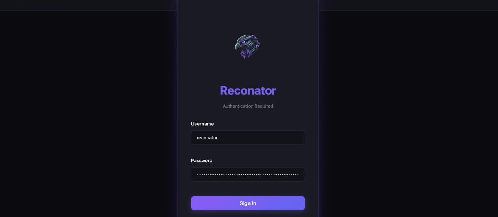

<p align="center">
  
</p>

<h1 align="center">Reconator</h1>

<p align="center">
  
</p>

<p align="center">
  <a href="https://github.com/rootsploit/reconator/releases"></a>
  <a href="https://github.com/rootsploit/reconator/blob/main/LICENSE"></a>
  <a href="https://goreportcard.com/report/github.com/rootsploit/reconator"></a>
  
</p>

<p align="center">
  <a href="docs/USAGE.md">Documentation</a> •
  <a href="#-features">Features</a> •
  <a href="#-installation">Install</a> •
  <a href="#-quick-start">Quick Start</a> •
  <a href="#-changelog">Changelog</a>
</p>

---

## Reconator

AI-powered reconnaissance framework for bug bounty hunters and security professionals. Supports AI-guided analysis, real-time web dashboard, and  comprehensive attack surface discovery.

- 🧠 **AI-Powered Analysis** - Multi-provider AI (Ollama/Groq/DeepSeek/Claude/OpenAI/Gemini) with auto key rotation
- 📊 **Risk Scoring** - 0-100 attack surface score with prioritized findings
- 🎯 **CVEMap Integration** - Real CVE data mapped to detected technologies
- 💡 **Manual Check Suggestions** - AI suggests SQLi/XSS tests even when automated tools miss them
- ⚡ **Easy to Install** - Single Go binary, run `reconator install --extras` to set up all dependencies
- 📟 **Interactive Web UI** - Run `reconator server` for a real-time dashboard with multi-mode scanning and visual recon data.



---

## ✨ Features

### 🎯 Core Capabilities

- 🕵️ **Subdomain Enumeration** - subfinder, amass, assetfinder, crt.sh, chaos (30+ sources)
  - 🌩️ **Chaos DB** - ProjectDiscovery's 10M+ subdomain dataset
  - ☁️ **Cloudlist** - Multi-cloud asset discovery (AWS, GCP, Azure, K8s)
- 🌐 **DNS Resolution** - Fast validation with puredns & dnsx
- ⚡ **Port Scanning** - naabu for speed, httpx for HTTP validation
- 🔍 **Web Crawling** - katana, waybackurls, gau for endpoint discovery
- 🛡️ **WAF/CDN Detection** - Identifies Cloudflare, Akamai + origin IP discovery
- 🎭 **Tech Fingerprinting** - Wappalyzer-based technology detection
- ☠️ **Subdomain Takeover** - subjack, subzy for dangling DNS detection
- 🔐 **DNS & Email Security** - SPF/DKIM/DMARC email validation, CAA/DNSSEC/AXFR DNS security checks
- 🌐 **WebScan Mode** - 14+ web vulnerability tests (SQLi, XSS, SSRF, etc.) with historic URL collection
- 📥 **Import/Pull** - Pull scan results from remote systems via SSH for local analysis

### 🤖 AI-Powered Intelligence

- 🧠 **Smart Template Selection** - AI analyzes tech stack and picks relevant nuclei templates
- 📋 **CVE Mapping** - Maps detected technologies to known CVEs via CVEMap
- 📊 **Risk Scoring** - 0-100 risk score based on attack surface analysis
- 💡 **Manual Test Suggestions** - Recommends SQLi/XSS tests even when automation fails
- 📝 **Attack Surface Report** - Prioritized findings with effort/impact ratings

### 🔐 Advanced Secrets Scanner

- 🔑 **50+ Token Patterns** - Comprehensive regex-based detection
  - **Cloud**: AWS, GCP, Azure, DigitalOcean, Heroku, Cloudflare
  - **Code**: GitHub PAT/OAuth, GitLab, NPM, PyPI tokens
  - **Payment**: Stripe, Square, PayPal, Braintree API keys
  - **Communication**: Slack, Discord, Telegram, Twilio
  - **AI Services**: OpenAI, Anthropic, Cohere API keys
  - **Generic**: Private keys, JWTs, Database URLs, OAuth secrets

### ☁️ Cloud Storage Security

- 🪣 **S3 Bucket Testing** - Multi-region discovery + permission testing
- 📦 **GCS & Azure Blob** - Bucket enumeration + access verification
- 🔄 **Auto Name Generation** - Creates bucket permutations from target domain

### 🚪 Admin Panel Discovery

- 🔍 **25+ Admin Paths** - `/admin`, `/wp-admin`, `/phpmyadmin`, `/jenkins`, `/grafana`
- 🔐 **Login Form Detection** - Identifies auth types and login pages
- 📄 **Title Extraction** - Grabs page titles for quick identification

### ⚛️ GraphQL Detection

- 🔗 **16 Common Paths** - `/graphql`, `/graphiql`, `/playground`, `/v1/graphql`
- 🔓 **Introspection Testing** - Checks if schema is exposed
- 🎯 **Nuclei Integration** - Runs GraphQL-specific vulnerability templates

### 📸 Visual Recon

- 🖼️ **Screenshot Capture** - gowitness integration for visual evidence
- ⚡ **Parallel Processing** - Fast screenshot collection across all hosts
- 🎨 **Visual Clustering** - Groups similar screenshots automatically

### 🔒 DNS & Email Security

- 📧 **Email Authentication** - SPF, DKIM, DMARC record validation with scoring
- 🛡️ **DNS Security Checks** - CAA records, DNSSEC validation, zone transfer testing
- 🔍 **Nameserver Analysis** - Detects dangling nameservers and single points of failure
- 📊 **Security Scores** - 0-100 scoring for email and DNS security posture

### 🕵️ OSINT Module

- 🔎 **Google Dork Generator** - 15 dork categories with clickable links
- 🆓 **No API Required** - Works without external API keys


### 📊 Reporting

- 📈 **HTML Dashboard** - Modern, responsive report with dark theme
- 📋 **Executive Summary** - Key metrics at a glance
- ⚠️ **Vulnerability Breakdown** - Critical/High findings highlighted
- 🔍 **Per-Subdomain View** - Ports, tech, vulns per host with search/filter
- 🔗 **Attack Chain Analysis** - AI-identified vulnerability chains
- 📊 **Prioritized Findings** - Ranked by exploitability

---

## 📦 Installation

### ⚡ Quick Install (Recommended)

**Single command - no npm required!** The binary includes the web dashboard.

```bash
# Using Go (fastest)
go install github.com/rootsploit/reconator@latest

# Install reconnaissance tools
reconator install --extras

# Start scanning!
reconator scan example.com
```

### 📥 Other Installation Methods

<details>
<summary><b>One-liner install script</b> (Coming soon)</summary>

```bash
# Linux/macOS/WSL
curl -sSfL https://raw.githubusercontent.com/rootsploit/reconator/main/scripts/install.sh | bash

# Installs to /usr/local/bin
reconator install --extras
```
</details>

<details>
<summary><b>From GitHub Releases</b></summary>

Download pre-built binaries from [Releases](https://github.com/rootsploit/reconator/releases/latest):

```bash
# Linux (x86_64)
wget https://github.com/rootsploit/reconator/releases/latest/download/reconator-linux-x86_64
chmod +x reconator-linux-x86_64
sudo mv reconator-linux-x86_64 /usr/local/bin/reconator

# macOS (Apple Silicon)
wget https://github.com/rootsploit/reconator/releases/latest/download/reconator-darwin-aarch64
chmod +x reconator-darwin-aarch64
sudo mv reconator-darwin-aarch64 /usr/local/bin/reconator

# Windows
# Download reconator-windows-x86_64.exe from releases page
```
</details>

<details>
<summary><b>From Source</b> (For developers)</summary>

**Note:** Building from source is only needed for development. For normal use, prefer `go install` above.

```bash
git clone https://github.com/rootsploit/reconator.git
cd reconator

# Build with embedded web dashboard (requires Node.js for UI development)
./build.sh

# Or build without web UI rebuild
go build -o reconator ./cmd/reconator

# Install tools
./reconator install --extras
```

The web dashboard is automatically embedded in the binary during build. No npm install needed at runtime!
</details>

### 🔄 Keeping Updated

```bash
# Check for updates and install latest version
reconator update

# Or force update
reconator update --force

# Rollback if needed
reconator update --rollback
```

---

## 🚀 Quick Start

```bash
# Basic scan
reconator scan target.com

# With AI analysis
export OPENAI_API_KEY="sk-..."
reconator scan target.com

# Full featured scan
reconator scan target.com --screenshots --graphql --osint

# Multiple targets
reconator scan -l targets.txt

# Passive mode
reconator scan target.com --passive

# WebScan - Dedicated web vulnerability scanner
reconator webscan https://target.com
reconator webscan https://target.com --fast  # Quick nuclei scan only

# Import remote scan results
reconator import user@remote-host --list               # List available scans
reconator import user@remote-host --scan-id a1b2c3d4  # Pull specific scan

# Start web server
reconator server
# Access at http://127.0.0.1:8888
```

### 🌐 Web Dashboard

Start the web dashboard for real-time scan management:

```bash
# Start server (localhost only, secure)
reconator server

# Start with custom API key
reconator server --api-key "your-secure-key"

# Custom port
reconator server --port 9000
```

Then access at **http://127.0.0.1:8888**

**Login credentials**: Username is `reconator`, password is the API key shown in the server console output

### 📁 Output Structure

All scan results are stored in **`~/reconator/`** by default:

```
~/reconator/
# Regular reconnaissance scan
└── target.com/
    ├── 1-subdomains/        # Subdomain enumeration results
    ├── 2-waf/               # WAF/CDN detection
    ├── 3-ports/             # Port scan results
    ├── 4-vhost/             # Virtual host discovery
    ├── 5-takeover/          # Subdomain takeover checks
    ├── 6-historic/          # Historic URLs
    ├── 6b-secheaders/       # DNS & Email security findings
    ├── 7-tech/              # Technology detection
    ├── 8-dirbrute/          # Directory bruteforce
    ├── 9-vulnscan/          # Vulnerability findings
    ├── 9-screenshots/       # Screenshot captures
    ├── 10-aiguided/         # AI analysis
    ├── report_target.com.html  # HTML report
    ├── summary.json         # Scan summary
    └── reconator.db         # SQLite database with all scan data

# WebScan output (UUID-prefixed for isolation)
└── a1b2c3d4_target.com/
    ├── 5-historic/          # Historic URL collection (categorized by vulnerability type)
    ├── 6-tech/              # Technology detection
    ├── 6b-secheaders/       # Security headers analysis
    ├── 8-vulnscan/          # Vulnerability findings (all 14+ tests)
    ├── report_target.com.html  # HTML vulnerability report
    └── reconator.db         # Isolated SQLite database for this scan
```


**Dashboard Features:**
- ⚡ Real-time scan progress with live updates
- 📊 Vulnerability statistics and risk scoring
- 🔍 Browse and filter scan results
- 📥 Export results (CSV, JSON, SARIF, HTML)
- ⚙️ Configure API keys for OSINT/AI providers
- 🔐 Secure authentication with rate limiting


### ⚙️ Configuration

Reconator uses a unified config file (`~/.reconator/config.yaml`) for ALL API keys:

```bash
# Show current configuration
reconator config show

# Sync keys to subfinder/notify
reconator config sync

# Validate your API keys
reconator config test
```

See [Configuration Guide](docs/CONFIGURATION.md) for detailed setup.

---

## 📊 Comparison

| Feature | Reconator | reconFTW | FinalRecon |
|---------|:---------:|:--------:|:----------:|
| **AI Analysis** | ✅ GPT-4/Claude/Gemini | ❌ | ❌ |
| **CVE Intelligence** | ✅ CVEMap | nuclei only | ❌ |
| **Risk Scoring** | ✅ 0-100 | ❌ | ❌ |
| **Secret Detection** | ✅ 50+ patterns | JS only | ❌ |
| **Cloud Storage** | ✅ S3/GCS/Azure | S3 only | ❌ |
| **Admin Panels** | ✅ 25+ paths | ❌ | Dir brute |
| **GraphQL Detection** | ✅ 16 paths | ❌ | ❌ |
| **Screenshot Capture** | ✅ gowitness | gowitness | ❌ |
| **OSINT Dorks** | ✅ 15 categories | ✅ | ❌ |
| **HTML Reports** | ✅ | ✅ | ❌ |
| **Subdomain Sources** | 30+ | 30+ | 10+ |
| **Single Binary** | ✅ Go | Bash scripts | Python |

---

## 🖥️ Platform Support

| Platform | Status |
|----------|:------:|
| Linux (Ubuntu, Debian, Fedora, Arch) | ✅ Full |
| macOS (Intel + Apple Silicon) | ✅ Full |
| Windows (WSL recommended) | ⚠️ Partial |

---

## 🙏 Credits

Built with tools from:
- [ProjectDiscovery](https://github.com/projectdiscovery) - nuclei, subfinder, httpx, naabu, katana
- [tomnomnom](https://github.com/tomnomnom) - waybackurls, assetfinder
- [hahwul](https://github.com/hahwul) - dalfox
- [OWASP](https://github.com/OWASP) - amass
- [sensepost](https://github.com/sensepost) - gowitness

---

## 📋 Changelog

### v1.1.0 - Performance Optimization, WebScan, Import, & Enhanced Security

- **🌐 WebScan Mode**: Dedicated web vulnerability scanner with 14+ tests (SQLi, XSS, SSRF, etc.), historic URL collection, smart deduplication, TruffleHog secret scanning
- **📥 Import/Pull**: Pull scan results from remote systems via SSH (`reconator import user@host --scan-id <id>`)
- **🌩️ Chaos DB**: ProjectDiscovery's 10M+ subdomain dataset integration via subfinder
- **☁️ Cloudlist**: Multi-cloud asset discovery (AWS, GCP, Azure, K8s) integration
- **📦 TOON Format**: Tree-Oriented Object Notation for AI analysis output - 45% token cost savings over JSON

- **⚡ Performance Improvements**:
  - **Parallel Nuclei Scanning**: Splits hosts into batches for concurrent vulnerability scanning (15-20 min savings on large scans)
  - **Template Caching**: Skips nuclei template updates during scans for faster execution (1-2 min savings)
  - **Port Scan Pipelining**: Streams discovered ports from naabu to httpx incrementally instead of waiting (2-3 min savings)
  - **Adaptive DNS Resolution**: Progressive backoff strategy with resolver rotation to handle rate limits (2-3 min savings)

- **🐛 Quality Improvements**:
  - Fixed JavaScript analysis results display in web dashboard
  - Improved scan result loading with better error handling
  - Enhanced debug logging for troubleshooting
  - Fixed database isolation per scan (each scan now has its own reconator.db in scan directory)
  - Fixed output manager to properly save all phase results (tech, headers, historic URLs, vulnerabilities)
  - Fixed HTML report generation from saved JSON phase outputs

### v1.0.0 - Web Dashboard & Multi-Format Export
- **🎨 Web Dashboard**: Modern React-based UI with real-time scan progress
  - Live progress updates with WebSocket streaming
  - Real-time vulnerability feed during scans
  - Interactive scan management (start, stop, view results)
  - Dark theme with responsive design
  - API key authentication
- **📤 Multi-Format Export**: CSV, JSON, SARIF, and HTML exports
  - Self-contained HTML reports with embedded screenshots
  - SARIF format for GitHub Security integration
  - Timestamp-based filenames to prevent overwrites
- **🔧 Performance Improvements**:
  - **Passive mode optimization**: Skips DNS bruteforce and permutations (alterx/mksub) for faster scans
    - Keeps API-based discovery and DNS validation for thoroughness
    - ~30-60 seconds for subdomain enumeration (vs 4-5 minutes with full bruteforce)


### v0.1.2 - Hybrid CVE Detection & Fast XSS Scanning
- **sxss XSS Scanner**: Fast XSS reflection scanning (150 concurrent threads)
- **Hybrid CVE Detection**: vulnx → NVD API → hardcoded → searchsploit
- **ExploitDB Integration**: Optional searchsploit support for exploit lookup
- **JS Analysis**: Clickable file paths in HTML report
- **DNS Fix**: Trusted resolvers for dnsx validation (prevents false positives)

### v0.1.1 - DNS Validation & Historic URL Fixes
- Fixed DNS validation false positives with unreliable resolvers
- Created trusted-resolvers.txt for reliable validation
- Fixed historic subdomain merging

### v0.1.0 - Initial Release
- 12-phase reconnaissance pipeline
- Multi-provider AI support (Ollama, Groq, Claude, OpenAI, Gemini)
- Unified config management
- Interactive HTML reports

[Full Changelog](docs/USAGE.md#changelog)

---

## ⚖️ Legal

**For authorized security testing only.** Always obtain written authorization before scanning.

---

## 📄 License

AGPL-3.0 - See [LICENSE](LICENSE)

---

<p align="center">
  <b>Created by <a href="https://twitter.com/RootSploit">@RootSploit</a></b>
</p>