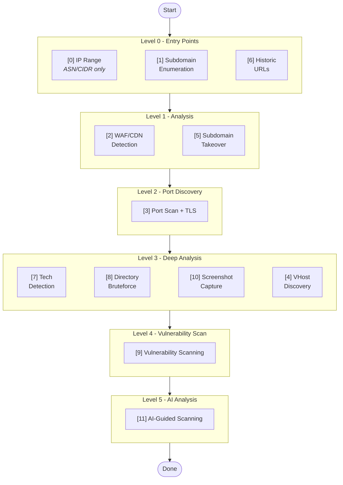
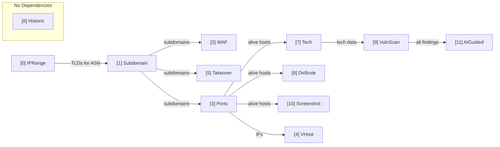

# Usage Guide

Complete usage documentation for Reconator.

---

## Table of Contents

- [Scanning Pipeline](#scanning-pipeline)
- [Basic Scanning](#basic-scanning)
- [Input Types](#input-types)
- [Phase Selection](#phase-selection)
- [Scan Modes](#scan-modes)
- [Performance Tuning](#performance-tuning)
- [AI-Guided Scanning](#ai-guided-scanning)
- [Notifications](#notifications)
- [Output Structure](#output-structure)
- [Command Reference](#command-reference)
  - [scan](#reconator-scan)
  - [webscan](#reconator-webscan)
  - [report](#reconator-report)
  - [export](#reconator-export)
  - [install](#reconator-install)
  - [check](#reconator-check)
  - [update](#reconator-update)
  - [server](#reconator-server)
  - [monitor](#reconator-monitor)
- [Examples](#examples)
- [Changelog](#changelog)

---

## Scanning Pipeline

Reconator executes phases in optimized parallel groups (levels) for maximum speed.



### Phase Dependencies



### Phase Details

| Phase | Name | Tools | Output |
|:-----:|------|-------|--------|
| **0** | IP Range Discovery | asnmap, whois, hakip2host | IPs, TLDs |
| **1** | Subdomain Enumeration | subfinder, assetfinder, findomain, puredns, alterx, mksub, dnsx, tlsx | Validated subdomains |
| **2** | WAF/CDN Detection | cdncheck, hakoriginfinder | CDN hosts, direct hosts, origin IPs |
| **3** | Port Scanning | naabu, tlsx | Open ports, TLS info, alive hosts |
| **4** | VHost Discovery | ffuf, tlsx | Virtual hosts |
| **5** | Subdomain Takeover | nuclei, subzy, subjack | Vulnerable takeovers |
| **6** | Historic URLs | waybackurls, gau, waymore, urlfinder, uro, gf | URLs, JS files, params |
| **7** | Tech Detection | httpx | Technologies, versions |
| **8** | DNS & Email Security | dig, nslookup, nuclei | SPF/DKIM/DMARC, CAA/DNSSEC/AXFR, security scores |
| **9** | Directory Bruteforce | feroxbuster, gobuster, ffuf | Hidden paths, admin panels |
| **10** | Vulnerability Scan | nuclei, dalfox, sxss, searchsploit | Vulnerabilities, XSS, CVEs |
| **11** | Screenshot Capture | gowitness | Screenshots, clusters |
| **12** | AI-Guided Scanning | OpenAI/Claude/Gemini + nuclei | CVE analysis, attack chains |

### Key Optimizations

- **Level 0**: Historic runs parallel with Subdomain (no dependency)
- **Level 1**: WAF + Takeover run parallel (both need subdomains, independent of each other)
- **Level 3**: Tech + DirBrute + Screenshot + VHost run parallel (all need ports, independent)
- **Tech-aware VulnScan**: Uses detected technologies to select relevant nuclei templates
- **CDN filtering**: Non-CDN hosts get priority in vuln scanning (3x more vulns found)

---

## Basic Scanning

```bash
# Single domain
reconator scan example.com

# Multiple domains from file
reconator scan -l domains.txt

# Custom output directory
reconator scan example.com -o ./output
```

---

## Input Types

### Domain

```bash
reconator scan example.com
```

### IP Address

```bash
# Discovers domains via reverse DNS + TLS certificates
reconator scan 192.168.1.1
```

### CIDR Range

```bash
# Expands CIDR and discovers all associated domains
reconator scan 10.0.0.0/24
```

### ASN

```bash
# Discovers CIDR ranges + domains via asnmap
reconator scan AS13335

# Also accepts without AS prefix
reconator scan 15169
```

---

## Phase Selection

### Run All Phases

```bash
reconator scan example.com -p all
```

### Run Specific Phases

```bash
reconator scan example.com -p subdomain,ports,takeover
```

### Available Phases

| Phase | Name | Description |
|-------|------|-------------|
| `subdomain` | Subdomain enumeration | 30+ passive sources + DNS bruteforce |
| `waf` | WAF/CDN detection | Identifies CDN-protected vs direct hosts |
| `ports` | Port scanning | naabu + httpx probing |
| `takeover` | Subdomain takeover | Checks for dangling DNS |
| `historic` | Historic URL collection | wayback, gau, katana crawling |
| `tech` | Technology detection | Wappalyzer fingerprinting |
| `dirbrute` | Directory bruteforce | feroxbuster/ffuf |
| `vulnscan` | Vulnerability scanning | nuclei + dalfox |
| `aiguided` | AI-guided scanning | CVEMap + AI recommendations |
| `graphql` | GraphQL detection | 16 common paths + introspection |
| `osint` | OSINT dorks | Google dork generation |

---

## Scan Modes

### Passive Mode

No active scanning, no port scanning, no crawling. Safe for stealth recon.

```bash
reconator scan example.com --passive
```

### Full Featured Scan

```bash
reconator scan example.com --screenshots --graphql --osint
```

### Skip Specific Phases

```bash
reconator scan example.com --skip-dirbrute --skip-vulnscan --skip-aiguided
```

### Debug Mode

Detailed timing logs for performance analysis.

```bash
reconator scan example.com --debug
```

---

## Performance Tuning

### Concurrency

Controls parallel threads for subfinder, naabu, httpx, katana.

```bash
reconator scan example.com -c 100
```

### DNS Threads

Specifically for puredns/dnsx DNS resolution.

```bash
reconator scan example.com --dns-threads 200
```

### Rate Limiting

For port scanning (packets per second).

```bash
reconator scan example.com -r 50
```

### Skip DNS Validation

Faster but may include dead subdomains.

```bash
reconator scan example.com --skip-validation
```

---

## AI-Guided Scanning

### Multi-Provider AI Support

Reconator supports multiple AI providers with automatic failover and key rotation:

| Priority | Provider | Model | Notes |
|:--------:|----------|-------|-------|
| 1 | Ollama | qwen2.5:32b | Local, free, private |
| 2 | Groq | llama-3.1-70b | Fast, generous free tier |
| 3 | DeepSeek | deepseek-chat | Cheap, good quality |
| 4 | Claude | claude-sonnet-4 | Best for security analysis |
| 5 | OpenAI | gpt-4o-mini | Reliable fallback |
| 6 | Gemini | gemini-1.5-flash | Google AI |

### Configuration

**Option 1: Config File (Recommended)**

Create `~/.reconator/ai-config.yaml`:

```yaml
providers:
  - name: ollama
    endpoint: "http://localhost:11434"
    model: "qwen2.5:32b"
    keys: []

  - name: groq
    keys: ["gsk_YOUR_KEY"]
    model: "llama-3.1-70b-versatile"
    rpm_limit: 30

  - name: claude
    keys: ["sk-ant-YOUR_KEY"]
    model: "claude-sonnet-4-20250514"
    rpm_limit: 50
```

**Option 2: Environment Variables**

```bash
export OPENAI_API_KEY="sk-..."
export ANTHROPIC_API_KEY="sk-ant-..."
export GEMINI_API_KEY="..."
export GROQ_API_KEY="gsk_..."
export DEEPSEEK_API_KEY="sk-..."
```

### How It Works

1. Collects technology fingerprints from scan results
2. Queries CVEMap for relevant CVEs
3. Uses AI to analyze context and recommend nuclei templates
4. Runs targeted scans based on AI recommendations
5. Generates attack surface report with risk score (0-100)
6. Identifies vulnerability chains for combined exploitation
7. Auto-rotates API keys on rate limit (429 errors)

---

## Notifications

### Enable Notifications

```bash
reconator scan example.com --notify
```

### Custom Configuration

```bash
reconator scan example.com --notify --notify-config ~/.config/notify/provider-config.yaml
```

### Supported Providers

| Provider | Configuration |
|----------|---------------|
| Slack | Webhook URL |
| Discord | Webhook URL |
| Telegram | Bot token + Chat ID |
| Email | SMTP settings |
| Custom | Webhook URL |

See [ProjectDiscovery notify](https://github.com/projectdiscovery/notify) for detailed configuration.

### Example: Slack Setup

```yaml
# ~/.config/notify/provider-config.yaml
slack:
  - id: "reconator"
    slack_webhook_url: "https://hooks.slack.com/services/XXX/YYY/ZZZ"
```

---

## Output Structure

Each scan creates a structured output directory:

```
results/target.com/
├── report_target.com.html          # 📊 HTML Dashboard Report
├── google_dorks.md                 # 🕵️ OSINT Google Dorks
├── summary.json                    # Scan metadata and statistics
│
├── 0-iprange/                      # IP/ASN Discovery
│   ├── ip_discovery.json
│   ├── ips.txt
│   └── domains.txt
│
├── 1-subdomains/                   # Subdomain Enumeration
│   ├── subdomains.json
│   ├── subdomains.txt              # Validated subdomains
│   └── all_subdomains.txt          # All discovered
│
├── 2-waf/                          # WAF/CDN Detection
│   ├── waf_detection.json
│   ├── cdn_hosts.txt
│   └── direct_hosts.txt
│
├── 3-ports/                        # Port Scanning
│   ├── port_scan.json
│   ├── open_ports.txt
│   ├── alive_hosts.txt
│   └── tls_info.json
│
├── 4-takeover/                     # Subdomain Takeover
│   ├── takeover.json
│   └── vulnerable.txt
│
├── 5-historic/                     # Historic URLs
│   ├── historic_urls.json
│   ├── urls.txt
│   ├── categorized_urls.json       # XSS/SQLi/SSRF prone
│   └── endpoints.txt
│
├── 6-tech/                         # Technology Detection
│   ├── tech_detection.json
│   ├── tech_by_host.txt
│   └── tech_summary.txt
│
├── 7-dirbrute/                     # Directory Bruteforce
│   ├── dirbrute.json
│   └── discoveries.txt
│
├── 8-vulnscan/                     # Vulnerability Scanning
│   ├── vulnerabilities.json
│   ├── secrets.json                # 🔐 Detected secrets
│   ├── cloud_storage.json          # ☁️ S3/GCS/Azure buckets
│   ├── admin_panels.json           # 🚪 Admin panels
│   ├── critical.txt
│   ├── high.txt
│   └── all_vulnerabilities.txt
│
├── 9-aiguided/                     # AI-Guided Analysis
│   ├── ai_guided.json
│   ├── ai_recommendations.txt
│   ├── ai_vulnerabilities.txt
│   └── attack_surface_report.txt   # 📋 Risk score + priorities
│
├── graphql/                        # GraphQL Detection
│   ├── graphql.json
│   └── graphql_endpoints.txt
│
└── screenshots/                    # Screenshot Capture
    └── *.png
```

### Output Formats

| Format | Use Case |
|--------|----------|
| **JSON** | Complete structured data for programmatic access |
| **TXT** | Line-separated lists for piping to other tools |
| **HTML** | Executive report for sharing |
| **Markdown** | OSINT dorks with clickable links |

---

## Command Reference

### `reconator scan`

| Flag | Short | Description | Default |
|------|-------|-------------|---------|
| `--output` | `-o` | Output directory | `./results` |
| `--list` | `-l` | File containing targets | - |
| `--phases` | `-p` | Phases to run | `all` |
| `--passive` | - | Passive mode only | `false` |
| `--quick` | - | Quick mode: skip slow phases | `false` |
| `--threads` | `-c` | Thread count (0=auto) | `0` |
| `--dns-threads` | - | DNS resolver threads (0=auto) | `0` |
| `--rate` | `-r` | Rate limit (pps, 0=auto) | `0` |
| `--skip-validation` | - | Skip DNS validation | `false` |
| `--no-dns-brute` | - | Skip DNS bruteforce & permutations (keeps passive enum + validation) | `false` |
| `--no-screenshots` | - | Disable screenshot capture | `false` |
| `--no-graphql` | - | Disable GraphQL detection | `false` |
| `--no-osint` | - | Disable OSINT dorks | `false` |
| `--no-ai` | - | Disable AI-guided scanning | `false` |
| `--no-report` | - | Disable HTML report generation | `false` |
| `--deep` | - | Deep vuln scan with all templates | `false` |
| `--nuclei-tags` | - | Custom nuclei tags (comma-separated) | - |
| `--notify` | - | Enable notifications | `false` |
| `--notify-config` | - | Notify config path | - |
| `--debug` | - | Enable debug logging | `false` |

### `reconator install`

| Flag | Description |
|------|-------------|
| `--extras` | Install optional Python/Rust tools |

### `reconator check`

Verifies all required tools are installed and working.

### `reconator update`

Update reconator to the latest version from GitHub releases.

```bash
# Check for updates and install
reconator update

# Force update even if already on latest version
reconator update --force

# Rollback to previous version from backup
reconator update --rollback
```

**Features:**
- ✅ Automatic version checking from GitHub releases
- ✅ SHA256 checksum verification for security
- ✅ Progress bar during download
- ✅ Automatic backup of current binary (saved as `reconator.old`)
- ✅ Rollback support if update fails
- ✅ Release notes preview before updating
- ✅ User confirmation before replacing binary

**Update Process:**
1. Checks GitHub API for latest release
2. Compares versions using semantic versioning
3. Downloads binary for your OS/architecture
4. Verifies SHA256 checksum (if available)
5. Creates backup of current binary
6. Replaces binary with new version
7. Verifies installation

| Flag | Description | Default |
|------|-------------|---------|
| `--force` | Force update even if already on latest version | `false` |
| `--rollback` | Restore previous version from backup | `false` |

**Example Output:**
```
Reconator Auto-Updater
═════════════════════

Current version: v1.1.0
Checking for updates...

New version available: v1.1.0 → v1.2.0
Download size: 8.5 MB

Release Notes:
─────────────
- Add CloudFront CDN detection
- Add auto-update feature
- Fix AI prompt optimization

Do you want to update? [Y/n]: y

Downloaded: 8.5 MB / 8.5 MB (100%)
Verifying checksum...
✓ Checksum verified
Installing update...
✓ Successfully updated to v1.2.0
  Backup saved: /usr/local/bin/reconator.old

═════════════════════
Update completed successfully!

The old version has been saved as a backup.
If you experience any issues, you can rollback with:
  reconator update --rollback
```

**Rollback Example:**
```bash
$ reconator update --rollback
Rolling back from backup: /usr/local/bin/reconator.old
✓ Successfully rolled back to previous version
```

### `reconator webscan`

Run vulnerability scanning on a single URL (DAST mode).

```bash
# Basic single URL scan
reconator webscan https://example.com

# Deep scan with all nuclei templates
reconator webscan https://api.example.com/v1 --deep

# Fast mode (skip tech detection, run nuclei -as only)
reconator webscan https://example.com --fast

# Custom nuclei tags
reconator webscan https://example.com --nuclei-tags "cve,rce,sqli"
```

| Flag | Short | Description | Default |
|------|-------|-------------|---------|
| `--deep` | - | Deep scan with all nuclei templates | `false` |
| `--fast` | - | Fast mode: skip tech detection, run nuclei -as only | `false` |
| `--nuclei-tags` | - | Custom nuclei tags (comma-separated) | - |
| `--nuclei-timeout` | - | Nuclei timeout in minutes | `10` (fast), `30` (deep) |
| `--output` | `-o` | Output directory | `./results` |
| `--threads` | `-c` | Concurrent threads (0=auto) | `0` |
| `--screenshots` | - | Capture screenshots | `false` |
| `--debug` | - | Show detailed timing logs | `false` |

### `reconator report`

Regenerate HTML report from existing scan results.

```bash
# Regenerate report for a target
reconator report ./results/example.com

# Regenerate for ASN scan results
reconator report ./results/AS13335
```

Use this when you need to:
- Recreate a deleted report
- Generate a fresh report after manual data modifications
- Fix a corrupted report file

### `reconator export`

Export scan results to various formats for integration with other tools.

```bash
# Export to all formats (CSV, JSON, Markdown)
reconator export ./results/example.com

# Export only CSV files
reconator export ./results/example.com --format csv

# Export structured JSON
reconator export ./results/example.com --format json

# Export Markdown summary
reconator export ./results/example.com --format markdown
```

| Flag | Short | Description | Default |
|------|-------|-------------|---------|
| `--format` | `-f` | Export format: csv, json, markdown, all | `all` |

**Export Formats:**

| Format | Output | Use Case |
|--------|--------|----------|
| `csv` | Multiple CSV files | Spreadsheet analysis, data processing |
| `json` | Complete structured data | API integration, custom tooling |
| `markdown` | Summary report | Documentation, sharing |
| `all` | All formats | Comprehensive export |

### `reconator server`

Start the web dashboard server for real-time scan management and visualization.

```bash
# Start server on default port (8888)
reconator server

# Start on custom port
reconator server --port 9000

# Generate and use API key for authentication
reconator server --gen-key

# Allow external connections (use with caution!)
reconator server --host 0.0.0.0

# Use specific API key
reconator server --api-key YOUR_SECRET_KEY
```

**Features:**
- 🎯 Real-time scan progress with WebSocket updates
- 📊 Interactive dashboard with vulnerability statistics
- 🔍 Browse and filter scan results
- 📥 Export results (CSV, JSON, SARIF, HTML)
- ⚙️ Configure API keys for OSINT and AI providers
- 🔐 Optional API key authentication
- 🔄 Automatic JWT key rotation on restart (invalidates stale sessions)
- 🛡️ Built-in security (rate limiting, CORS, CSP headers)

| Flag | Short | Description | Default |
|------|-------|-------------|---------|
| `--port` | `-p` | Server port | `8888` |
| `--host` | `-h` | Server host (use `0.0.0.0` for external access) | `127.0.0.1` |
| `--api-key` | | API key for authentication | none |
| `--gen-key` | | Generate random API key | `false` |

**Access:**
1. Start the server: `reconator server`
2. Open browser: http://127.0.0.1:8888
3. Login with credentials (username: `reconator`, password: API key)
4. Manage scans, view results, configure API keys

**Security Notes:**
- By default, server binds to `127.0.0.1` (localhost only)
- Set `--host 0.0.0.0` to allow external connections
- Always use `--api-key` or `--gen-key` for production deployments
- API keys are stored securely in `~/.reconator/config.yaml` (0600 permissions)
- JWT authentication keys are automatically rotated on server restart for enhanced security
- All existing browser sessions are invalidated when the server restarts

### `reconator monitor`

Monitor attack surface changes over time. Performs periodic scans and alerts when changes are detected (new subdomains, ports, vulnerabilities, etc.).

```bash
# Monitor target every 24 hours
reconator monitor target.com --interval 24h

# Monitor with Slack notifications
reconator monitor target.com --interval 6h --slack https://hooks.slack.com/...

# Single comparison scan (no continuous monitoring)
reconator monitor target.com --once

# Monitor multiple targets
reconator monitor -l targets.txt --interval 12h
```

**Detects:**
- 🆕 New subdomains discovered
- 🔌 New open ports detected
- 🐛 New vulnerabilities found
- ⚠️ Subdomain takeover opportunities
- 🔧 Technology stack changes

| Flag | Short | Description | Default |
|------|-------|-------------|---------|
| `--interval` | | Scan interval (e.g., 6h, 12h, 24h) | `24h` |
| `--once` | | Single comparison scan | `false` |
| `--slack` | | Slack webhook URL for alerts | none |
| `--discord` | | Discord webhook URL for alerts | none |
| `--webhook` | | Custom webhook URL for alerts | none |

### `reconator version`

Display version information.

```bash
reconator version
```

---

## Examples

### Bug Bounty Quick Scan

```bash
reconator scan target.com -p subdomain,ports,takeover,vulnscan
```

### Full Reconnaissance

```bash
reconator scan target.com -p all -c 100 --screenshots --graphql --osint --notify
```

### Passive Recon Only

```bash
reconator scan target.com --passive
```

### ASN Investigation

```bash
reconator scan AS13335 -p all
```

### High-Speed Scan

```bash
reconator scan target.com -c 200 --dns-threads 300 -r 200 --skip-validation
```

---

## Changelog

### v0.1.2 - Hybrid CVE Detection & Fast XSS Scanning

**New Features:**
- **sxss XSS Scanner**: Fast XSS reflection scanning with 150 concurrent threads
  - Runs in parallel with dalfox for comprehensive XSS detection
  - Command: `cat urls.txt | sxss -concurrency 150 -retries 3`
- **Hybrid CVE Detection System**: Dynamic vulnerability lookup from multiple sources
  - Priority chain: vulnx → NVD API → hardcoded database → searchsploit
  - Local CVE cache with 24-hour TTL at `~/.reconator/cve-cache/`
  - ExploitDB integration via searchsploit (optional)
- **JS Analysis Improvements**: File paths in HTML report are now clickable hyperlinks

**Fixes:**
- DNS validation now uses trusted resolvers (~25 reliable servers) instead of full 18k list
- Prevents false positives from unreliable public DNS servers during dnsx validation
- puredns bruteforce still uses full 18k resolvers for better coverage

**New Dependencies:**
```bash
# Required (installed automatically)
go install github.com/unstabl3/sxss@latest

# Optional (for ExploitDB CVE lookup)
sudo apt install exploitdb
searchsploit -u
```

---

### v0.1.1 - DNS Validation & Historic URL Fixes

**Fixes:**
- Fixed DNS validation creating false positives with unreliable resolvers
- Created trusted-resolvers.txt (~25 reliable public DNS servers) for dnsx validation
- Fixed historic subdomain merging not including all sources
- Improved subdomain deduplication logic

**Improvements:**
- Separated resolver files: 18k for puredns bruteforce, ~25 trusted for validation
- Better error handling in historic URL collection
- Improved wayback/gau/waymore result merging

---

### v0.1.0 - Initial Release

**Core Features:**
- 12-phase reconnaissance pipeline with parallel execution
- Multi-input support: domains, IPs, CIDRs, ASNs
- Subdomain enumeration with 30+ passive sources + DNS bruteforce
- WAF/CDN detection and origin IP discovery
- Port scanning with TLS fingerprinting
- Subdomain takeover detection
- Historic URL collection (wayback, gau, waymore)
- Technology detection with version fingerprinting
- Directory bruteforce with smart wordlist selection
- Vulnerability scanning with nuclei + dalfox
- Screenshot capture with clustering
- AI-guided scanning with multi-provider support (Ollama, Groq, Claude, OpenAI, Gemini)

**Configuration:**
- Unified API key management (`~/.reconator/config.yaml`)
- Auto-sync to subfinder and notify configs
- Multi-provider AI with automatic failover and key rotation

**Output:**
- Structured JSON output for all phases
- Interactive HTML dashboard report
- Google dorks generation for OSINT
- Export to CSV, JSON, Markdown formats

---

<p align="center">
  <a href="README.md">Back to README</a>
</p>
