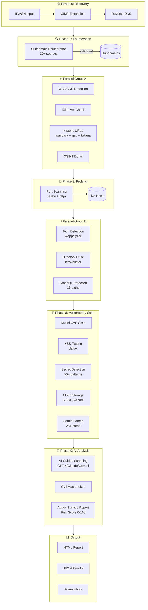

# Usage Guide

Complete usage documentation for Reconator.

---

## Table of Contents

- [Scanning Pipeline](#scanning-pipeline)
- [Basic Scanning](#basic-scanning)
- [Input Types](#input-types)
- [Phase Selection](#phase-selection)
- [Scan Modes](#scan-modes)
- [Performance Tuning](#performance-tuning)
- [AI-Guided Scanning](#ai-guided-scanning)
- [Notifications](#notifications)
- [Output Structure](#output-structure)
- [Command Reference](#command-reference)

---

## Scanning Pipeline


```mermaid
flowchart TB
    subgraph Phase0["🌐 Phase 0: Discovery"]
        IP[IP/ASN Input] --> CIDR[CIDR Expansion]
        CIDR --> RevDNS[Reverse DNS]
    end

    subgraph Phase1["🔍 Phase 1: Enumeration"]
        SUB[Subdomain Enumeration<br/>30+ sources]
        SUB --> |validated| SUBS[(Subdomains)]
    end

    subgraph ParallelA["⚡ Parallel Group A"]
        WAF[WAF/CDN Detection]
        TAKE[Takeover Check]
        HIST[Historic URLs<br/>wayback + gau + katana]
        OSINT[OSINT Dorks]
    end

    subgraph Phase3["🔌 Phase 3: Probing"]
        PORTS[Port Scanning<br/>naabu + httpx]
        PORTS --> ALIVE[(Live Hosts)]
    end

    subgraph ParallelB["⚡ Parallel Group B"]
        TECH[Tech Detection<br/>wappalyzer]
        DIR[Directory Brute<br/>feroxbuster]
        GQL[GraphQL Detection<br/>16 paths]
    end

    subgraph Phase8["🎯 Phase 8: Vulnerability Scan"]
        NUCLEI[Nuclei CVE Scan]
        XSS[XSS Testing<br/>dalfox]
        SECRETS[Secret Detection<br/>50+ patterns]
        CLOUD[Cloud Storage<br/>S3/GCS/Azure]
        ADMIN[Admin Panels<br/>25+ paths]
    end

    subgraph Phase9["🤖 Phase 9: AI Analysis"]
        AI[AI-Guided Scanning<br/>GPT-4/Claude/Gemini]
        CVEMAP[CVEMap Lookup]
        REPORT[Attack Surface Report<br/>Risk Score 0-100]
    end

    subgraph Output["📊 Output"]
        HTML[HTML Report]
        JSON[JSON Results]
        SCREEN[Screenshots]
    end

    Phase0 --> Phase1
    Phase1 --> ParallelA
    ParallelA --> Phase3
    Phase3 --> ParallelB
    ParallelB --> Phase8
    Phase8 --> Phase9
    Phase9 --> Output
```

---

## Basic Scanning

```bash
# Single domain
reconator scan example.com

# Multiple domains from file
reconator scan -l domains.txt

# Custom output directory
reconator scan example.com -o ./output
```

---

## Input Types

### Domain

```bash
reconator scan example.com
```

### IP Address

```bash
# Discovers domains via reverse DNS + TLS certificates
reconator scan 192.168.1.1
```

### CIDR Range

```bash
# Expands CIDR and discovers all associated domains
reconator scan 10.0.0.0/24
```

### ASN

```bash
# Discovers CIDR ranges + domains via asnmap
reconator scan AS13335

# Also accepts without AS prefix
reconator scan 15169
```

---

## Phase Selection

### Run All Phases

```bash
reconator scan example.com -p all
```

### Run Specific Phases

```bash
reconator scan example.com -p subdomain,ports,takeover
```

### Available Phases

| Phase | Name | Description |
|-------|------|-------------|
| `subdomain` | Subdomain enumeration | 30+ passive sources + DNS bruteforce |
| `waf` | WAF/CDN detection | Identifies CDN-protected vs direct hosts |
| `ports` | Port scanning | naabu + httpx probing |
| `takeover` | Subdomain takeover | Checks for dangling DNS |
| `historic` | Historic URL collection | wayback, gau, katana crawling |
| `tech` | Technology detection | Wappalyzer fingerprinting |
| `dirbrute` | Directory bruteforce | feroxbuster/ffuf |
| `vulnscan` | Vulnerability scanning | nuclei + dalfox |
| `aiguided` | AI-guided scanning | CVEMap + AI recommendations |
| `graphql` | GraphQL detection | 16 common paths + introspection |
| `osint` | OSINT dorks | Google dork generation |

---

## Scan Modes

### Passive Mode

No active scanning, no port scanning, no crawling. Safe for stealth recon.

```bash
reconator scan example.com --passive
```

### Full Featured Scan

```bash
reconator scan example.com --screenshots --graphql --osint
```

### Skip Specific Phases

```bash
reconator scan example.com --skip-dirbrute --skip-vulnscan --skip-aiguided
```

### Debug Mode

Detailed timing logs for performance analysis.

```bash
reconator scan example.com --debug
```

---

## Performance Tuning

### Concurrency

Controls parallel threads for subfinder, naabu, httpx, katana.

```bash
reconator scan example.com -c 100
```

### DNS Threads

Specifically for puredns/dnsx DNS resolution.

```bash
reconator scan example.com --dns-threads 200
```

### Rate Limiting

For port scanning (packets per second).

```bash
reconator scan example.com -r 50
```

### Skip DNS Validation

Faster but may include dead subdomains.

```bash
reconator scan example.com --skip-validation
```

---

## AI-Guided Scanning

### Setting API Keys

**Via Environment Variables (Recommended)**

```bash
export OPENAI_API_KEY="sk-..."
export ANTHROPIC_API_KEY="sk-ant-..."
export GEMINI_API_KEY="..."
```

**Via Command Flags**

```bash
reconator scan example.com --openai-key "sk-..."
```

### How It Works

1. Collects technology fingerprints from scan results
2. Queries CVEMap for relevant CVEs
3. Uses AI to analyze context and recommend nuclei templates
4. Runs targeted scans based on AI recommendations
5. Generates attack surface report with risk score (0-100)

---

## Notifications

### Enable Notifications

```bash
reconator scan example.com --notify
```

### Custom Configuration

```bash
reconator scan example.com --notify --notify-config ~/.config/notify/provider-config.yaml
```

### Supported Providers

| Provider | Configuration |
|----------|---------------|
| Slack | Webhook URL |
| Discord | Webhook URL |
| Telegram | Bot token + Chat ID |
| Email | SMTP settings |
| Custom | Webhook URL |

See [ProjectDiscovery notify](https://github.com/projectdiscovery/notify) for detailed configuration.

### Example: Slack Setup

```yaml
# ~/.config/notify/provider-config.yaml
slack:
  - id: "reconator"
    slack_webhook_url: "https://hooks.slack.com/services/XXX/YYY/ZZZ"
```

---

## Output Structure

Each scan creates a structured output directory:

```
results/target.com/
├── report_target.com.html          # 📊 HTML Dashboard Report
├── google_dorks.md                 # 🕵️ OSINT Google Dorks
├── summary.json                    # Scan metadata and statistics
│
├── 0-iprange/                      # IP/ASN Discovery
│   ├── ip_discovery.json
│   ├── ips.txt
│   └── domains.txt
│
├── 1-subdomains/                   # Subdomain Enumeration
│   ├── subdomains.json
│   ├── subdomains.txt              # Validated subdomains
│   └── all_subdomains.txt          # All discovered
│
├── 2-waf/                          # WAF/CDN Detection
│   ├── waf_detection.json
│   ├── cdn_hosts.txt
│   └── direct_hosts.txt
│
├── 3-ports/                        # Port Scanning
│   ├── port_scan.json
│   ├── open_ports.txt
│   ├── alive_hosts.txt
│   └── tls_info.json
│
├── 4-takeover/                     # Subdomain Takeover
│   ├── takeover.json
│   └── vulnerable.txt
│
├── 5-historic/                     # Historic URLs
│   ├── historic_urls.json
│   ├── urls.txt
│   ├── categorized_urls.json       # XSS/SQLi/SSRF prone
│   └── endpoints.txt
│
├── 6-tech/                         # Technology Detection
│   ├── tech_detection.json
│   ├── tech_by_host.txt
│   └── tech_summary.txt
│
├── 7-dirbrute/                     # Directory Bruteforce
│   ├── dirbrute.json
│   └── discoveries.txt
│
├── 8-vulnscan/                     # Vulnerability Scanning
│   ├── vulnerabilities.json
│   ├── secrets.json                # 🔐 Detected secrets
│   ├── cloud_storage.json          # ☁️ S3/GCS/Azure buckets
│   ├── admin_panels.json           # 🚪 Admin panels
│   ├── critical.txt
│   ├── high.txt
│   └── all_vulnerabilities.txt
│
├── 9-aiguided/                     # AI-Guided Analysis
│   ├── ai_guided.json
│   ├── ai_recommendations.txt
│   ├── ai_vulnerabilities.txt
│   └── attack_surface_report.txt   # 📋 Risk score + priorities
│
├── graphql/                        # GraphQL Detection
│   ├── graphql.json
│   └── graphql_endpoints.txt
│
└── screenshots/                    # Screenshot Capture
    └── *.png
```

### Output Formats

| Format | Use Case |
|--------|----------|
| **JSON** | Complete structured data for programmatic access |
| **TXT** | Line-separated lists for piping to other tools |
| **HTML** | Executive report for sharing |
| **Markdown** | OSINT dorks with clickable links |

---

## Command Reference

### `reconator scan`

| Flag | Short | Description | Default |
|------|-------|-------------|---------|
| `--output` | `-o` | Output directory | `./results` |
| `--list` | `-l` | File containing targets | - |
| `--phases` | `-p` | Phases to run | `all` |
| `--passive` | - | Passive mode only | `false` |
| `--concurrency` | `-c` | Thread count | `50` |
| `--dns-threads` | - | DNS resolver threads | `100` |
| `--rate` | `-r` | Rate limit (pps) | `100` |
| `--skip-validation` | - | Skip DNS validation | `false` |
| `--skip-dirbrute` | - | Skip directory bruteforce | `false` |
| `--skip-vulnscan` | - | Skip vulnerability scan | `false` |
| `--skip-aiguided` | - | Skip AI-guided phase | `false` |
| `--screenshots` | - | Enable screenshot capture | `false` |
| `--graphql` | - | Enable GraphQL detection | `false` |
| `--osint` | - | Enable OSINT dorks | `false` |
| `--notify` | - | Enable notifications | `false` |
| `--notify-config` | - | Notify config path | - |
| `--debug` | - | Enable debug logging | `false` |

### `reconator install`

| Flag | Description |
|------|-------------|
| `--extras` | Install optional Python/Rust tools |

### `reconator check`

Verifies all required tools are installed and working.

---

## Examples

### Bug Bounty Quick Scan

```bash
reconator scan target.com -p subdomain,ports,takeover,vulnscan
```

### Full Reconnaissance

```bash
reconator scan target.com -p all -c 100 --screenshots --graphql --osint --notify
```

### Passive Recon Only

```bash
reconator scan target.com --passive
```

### ASN Investigation

```bash
reconator scan AS13335 -p all
```

### High-Speed Scan

```bash
reconator scan target.com -c 200 --dns-threads 300 -r 200 --skip-validation
```

---

<p align="center">
  <a href="README.md">Back to README</a>
</p>
